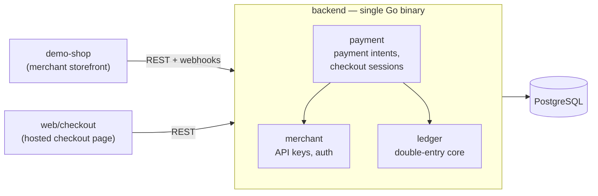

## Hello there — I'm Albert Tseng 👋

Frontend engineer in Taipei. I got curious about what happens after the "Pay" button,
so I'm building a payment system from the ledger up to find out.

📮 [tjtseng1072@gmail.com](mailto:tjtseng1072@gmail.com)

<!-- ─────────────────────────────────────────────────────────────
     SKELETON — uncomment each section as you fill it in.
     Everything below is hidden from the rendered profile page.
     ───────────────────────────────────────────────────────────── -->

<!--
### Currently

- TODO: what you actually own at XREX — one line, with a number or a scale
- **Open to frontend / full-stack roles in Australia**, ideally in fintech — Melbourne or Sydney, on-site or remote
- Work rights: TODO (482 sponsorship / 189 / 190 / WHV / PR)
- Timezone: UTC+8, ~2–3h from AEST — near-full overlap with an Australian workday
-->

<!--
### What I'm building

#### [LedgerPay](https://github.com/TJ72/ledgerpay) — a Stripe-shaped payment platform, built to be correct

Merchants integrate a REST API, customers pay through a hosted checkout, and every
money movement lands in a balanced double-entry ledger.

Currently designing it in the open — the architecture and the decision records are
further along than the code, which is the honest state of things. Starting as a
**modular monolith** on purpose: each module owns its tables and exposes a Go API,
so extracting `ledger-service` later is a mechanical move, not a redesign.

Go 1.25 · PostgreSQL 16 · Next.js
-->

<!--
### Why Australia

TODO — the domain-knowledge hook. Connect XREX crypto-fiat / AML experience to
the Australian payments stack: NPP / PayTo, BECS Direct Debit, Osko, AUSTRAC,
CDR. Two or three sentences, no more.
-->

<!--
### Tech

**Reach for daily** — TypeScript, React, Next.js, TODO
**Comfortable in** — Terraform, Cloudflare Workers, GitHub Actions, TODO
**Learning in the open** — Go, PostgreSQL, double-entry accounting
-->

<!--
### Writing

TODO — link the single best post directly, not the blog index, until there are 4–5.
-->

<!--
### Fun fact

TODO — something concrete and true that a stranger could open a conversation with.
Not "I like coffee."
-->
